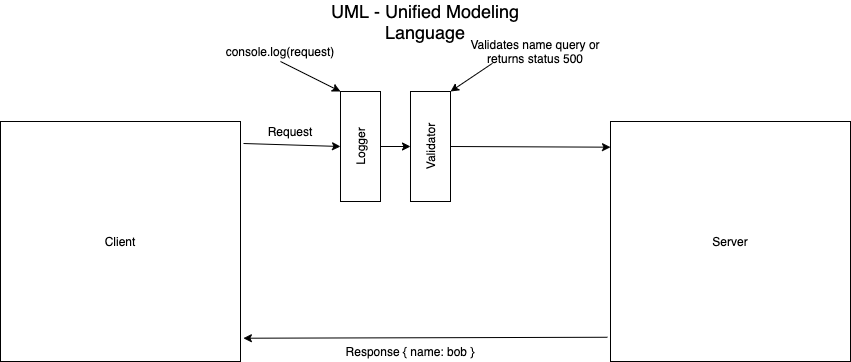

# LAB - 02 

## Project: Basic Express Server

### Author: Simon Panek

### Links and Resources

- [GitHub ci/cd](https://github.com/simon-panek/basic-express-server/actions)

- [Heroku Deployment](https://simonpanek-basicexpressserver.herokuapp.com/)

### Setup

#### `.env` requirements (where applicable)

- `PORT` - Port Number

#### How to initialize/run your application (where applicable)

- `npm start`
- `Endpoint: /person?name=<yourNameHere>`
  - Returns object `{ name: 'enterNameHere' }`

#### Tests

- To run the tests: `npm test`
- Tests of note:
  - One confirms that the route returns status 200 when a valid name is entered
  - One confirms that status 500 is returned when the name query is empty
  - One confirms that status 404 is returned when a bad route or method is requested
  - One confirms that when a valid name is queried, the correct object is output
- Describe any tests that you did not complete, skipped, etc
  - I do not currently have a test for the start(), if this were tested I expect that nearly 100% of the code would then be covered.

#### UML

